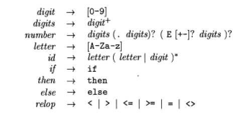
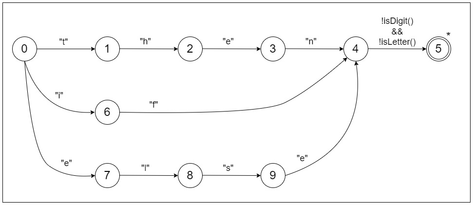
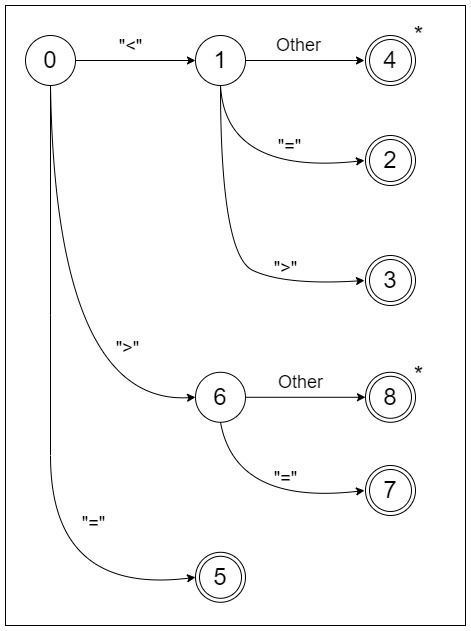
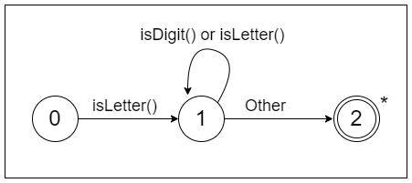
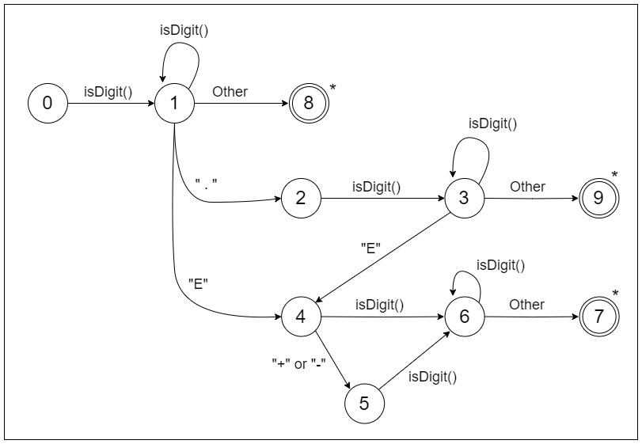
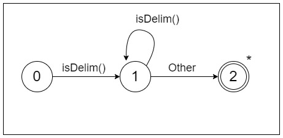

# Compiler Design Lab

---

## Implementing a lexical Analyzer
## Following are my details for assignment submission:

Name: &nbsp;&nbsp;&nbsp;&nbsp;Ayush Vinayak Asutkar

Roll No.: &nbsp;20CS01057

Semester: &nbsp;7th

Year of study: &nbsp;4th year

Subject: &nbsp;&nbsp;Compiler Design Laboratory

Assignment: &nbsp;Assignment - 2

---

### Problem Statement

Implement a lexical analyzer using any programming language. Your program should take a statement as input
and return the sequence of tokens as output.

For more details check the pdf: <a href="Question.pdf">"Question.pdf"</a>

### How to run
1. Clone the repository: https://github.com/Ayush-Asutkar/Regular-Expression-To-NFA-DFA.git
2. Open in your favourite editor. (The editor used while making this project was Intellij IDEA)
3. Run the complete project by running the Main.java in src folder. Write input in a particular line on the console. Pressing enter will execute the program.

Example input:

if input<10 then output1=100 else output2>=100

else if then then2 else3 ifthen if3

The output will be printed as list of lexemes

### Patterns:

The patterns for the tokens in the language are described below:

### Transition Diagrams for the tokens:

These transition diagrams were used to identify tokens in the string of the input program. 
These machines run sequentially, and in the preference order of keywords, relational operators, identifiers, numbers and delimiters.

#### Keywords Machine:

#### Relational Operator Machine:

#### Identifiers Machine:

#### Numbers Machine:

#### Delim Machine:

